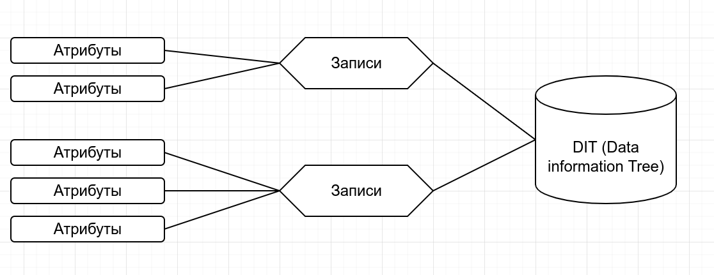
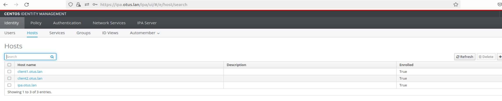

# Цель домашнего задания
Научиться настраивать LDAP-сервер и подключать к нему LDAP-клиентов

<pre>
Описание домашнего задания
1) Установить FreeIPA
2) Написать Ansible-playbook для конфигурации клиента

</pre>

## Введение
<pre>
LDAP (Lightweight Directory Access Protocol — легковесный протокол доступа к каталогам) —  это протокол для хранения и получения данных из каталога с иерархической структурой.

С увеличением числа серверов затрудняется управление пользователями на этих сервере. LDAP решает задачу централизованного управления доступом. 
С помощью LDAP можно синхронизировать:
●	UID пользователей
●	Группы (GID)
●	Домашние каталоги
●	Общие настройки для хостов 
●	И т. д. 

LDAP работает на следующих портах: 
●	389/TCP — без TLS/SSL
●	636/TCP — с TLS/SSL

Основные компоненты LDAP
</pre>

<pre>
●	Атрибуты — пара «ключ-значение». Пример атрибута: mail: admin@example.com
●	Записи (entry) — набор атрибутов под именем, используемый для описания чего-либо

Пример записи:
dn: sn=Ivanov, ou=people, dc=digitalocean,dc=com
objectclass: person
sn: Ivanov
cn: Ivan Ivanov

●	Data Information Tree (DIT) — организационная структура, где каждая запись имеет ровно одну родительскую запись и под ней может находиться любое количество дочерних записей. Запись верхнего уровня — исключение
На основе LDAP построенно много решений, например: Microsoft Active Directory, OpenLDAP, FreeIPA и т. д.

В данной лабораторной работе будет рассмотрена установка и настройка FreeIPA. FreeIPA — это готовое решение, включающее в себе:
●	Сервер LDAP на базе Novell 389 DS c предустановленными схемами
●	Сервер Kerberos
●	Предустановленный BIND с хранилищем зон в LDAP
●	Web-консоль управления
</pre>

# Решение:

## 1. Работа со стендом и настройка DNS
<pre>
Данный Vagrantfile развернёт 3 виртаульных машин ОС CentOS 8 Stream. Каждая ВМ будет иметь по 2ГБ ОЗУ и по два ядра CPU. 

## 1) Установка FreeIPA сервера

Для начала нам необходимо настроить FreeIPA-сервер. Подключимся к нему по SSH с помощью команды: vagrant ssh ipa.otus.lan и перейдём в root-пользователя: sudo -i 

Начнём настройку FreeIPA-сервера: 
●	Установим часовой пояс: timedatectl set-timezone Europe/Moscow
●	Установим утилиту chrony: yum install -y chrony
●	Запустим chrony и добавим его в автозагрузку: systemctl enable chronyd —now
●	Если требуется, поменяем имя нашего сервера: hostnamectl set-hostname <имя сервера>
В нашей лабораторной работе данного действия не требуется, так как уже указаны корректные имена в Vagrantfile
●	Выключим Firewall: systemctl stop firewalld
●	Отключим автозапуск Firewalld: systemctl disable firewalld
●	Остановим Selinux: setenforce 0
●	Поменяем в файле /etc/selinux/config, параметр Selinux на disabled
vi /etc/selinux/config

# This file controls the state of SELinux on the system.
# SELINUX= can take one of these three values:
#     enforcing - SELinux security policy is enforced.
#     permissive - SELinux prints warnings instead of enforcing.
#     disabled - No SELinux policy is loaded.
SELINUX=disabled
# SELINUXTYPE= can take one of these three values:
#     targeted - Targeted processes are protected,
#     minimum - Modification of targeted policy. Only selected processes are protected. 
#     mls - Multi Level Security protection.
SELINUXTYPE=targeted

●	Для дальнейшей настройки FreeIPA нам потребуется, чтобы DNS-сервер хранил запись о нашем LDAP-сервере. В рамках данной лабораторной работы мы не будем настраивать отдельный DNS-сервер и просто добавим запись в файл /etc/hosts
vi /etc/hosts
127.0.0.1   localhost localhost.localdomain localhost4 localhost4.localdomain4
::1         localhost localhost.localdomain localhost6 localhost6.localdomain6

127.0.0.1 centos8.localdomain

127.0.1.1 ipa.otus.lan ipa
192.168.57.10 ipa.otus.lan ipa

Также внесем изменения в файл /etc/sysctl.conf:
net.ipv6.conf.all.disable_ipv6 = 0

 

●	Установим модуль DL1: yum install -y @idm:DL1
●	Установим FreeIPA-сервер: yum install -y ipa-server

●	Запустим скрипт установки: ipa-server-install
Далее, нам потребуется указать параметры нашего LDAP-сервера, после ввода каждого параметра нажимаем Enter, если нас устраивает параметр, указанный в квадратных скобках, то можно сразу нажимать Enter:

Do you want to configure integrated DNS (BIND)? [no]: no
Server host name [ipa.otus.lan]: <Нажимем Enter>
Please confirm the domain name [otus.lan]: <Нажимем Enter>
Please provide a realm name [OTUS.LAN]: <Нажимем Enter>
Directory Manager password: <Указываем пароль минимум 8 символов>
Password (confirm): <Дублируем указанный пароль>
IPA admin password: <Указываем пароль минимум 8 символов>
Password (confirm): <Дублируем указанный пароль>
NetBIOS domain name [OTUS]: <Нажимем Enter>
Do you want to configure chrony with NTP server or pool address? [no]: no
The IPA Master Server will be configured with:
Hostname:       ipa.otus.lan
IP address(es): 192.168.57.10
Domain name:    otus.lan
Realm name:     OTUS.LAN

The CA will be configured with:
Subject DN:   CN=Certificate Authority,O=OTUS.LAN
Subject base: O=OTUS.LAN
Chaining:     self-signed
Проверяем параметры, если всё устраивает, то нажимаем yes
Continue to configure the system with these values? [no]: yes

Далее начнётся процесс установки. Процесс установки занимает примерно 10-15 минут (иногда время может быть другим). Если мастер успешно выполнит настройку FreeIPA то в конце мы получим сообщение: 
The ipa-server-install command was successful

При вводе параметров установки мы вводили 2 пароля:
●	Directory Manager password — это пароль администратора сервера каталогов, У этого пользователя есть полный доступ к каталогу.
●	IPA admin password — пароль от пользователя FreeIPA admin

После успешной установки FreeIPA, проверим, что сервер Kerberos может выдать нам билет: 
[root@ipa ~]# kinit admin
Password for admin@OTUS.LAN:  #Указываем Directory Manager password
[root@ipa ~]# klist 
Ticket cache: KCM:0
Default principal: admin@OTUS.LAN

Valid starting     Expires            Service principal
04/24/24 16:02:01  04/25/24 16:01:55  krbtgt/OTUS.LAN@OTUS.LAN
04/24/24 16:02:07  04/25/24 16:01:55  HTTP/ipa.otus.lan@OTUS.LAN

Для удаление полученного билета воспользуемся командой: kdestroy

Мы можем зайти в Web-интерфейс нашего FreeIPA-сервера, для этого на нашей хостой машине нужно прописать следующую строку в файле Hosts:
192.168.57.10 ipa.otus.lan

В Unix-based системах файл хост находится по адресу /etc/hosts, в Windows — c:\Windows\System32\Drivers\etc\hosts. Для добавления строки потребуются права администратора.

После добавления DNS-записи откроем c нашей хост-машины веб-страницу vagranvagra

Откроется окно управления FreeIPA-сервером. В имени пользователя укажем admin, в пароле укажем наш IPA admin password и нажмём войти. 

Откроется веб-консоль упрвления FreeIPA. Данные во FreeIPA можно вносить как через веб-консоль, так и средствами коммандной строки.

На этом установка и настройка FreeIPA-сервера завершена.
</pre>

## 2) Ansible playbook для конфигурации клиента

С помощью provision.yml настраиваются два клиента client1 и client2 и добавляются в домен otus.lan.

<pre>
Давайте проверим работу LDAP, для этого на сервере FreeIPA создадим пользователя и попробуем залогиниться к клиенту:
●	Авторизируемся на сервере: kinit admin
●	Создадим пользователя otus-user
[root@ipa ~]# kinit admin
Password for admin@OTUS.LAN: 
[root@ipa ~]# ipa user-add otus-user --first=Otus --last=User --password
Password: 
Enter Password again to verify: 
----------------------
Added user "otus-user"
----------------------
  User login: otus-user
  First name: Otus
  Last name: User
  Full name: Otus User
  Display name: Otus User
  Initials: OU
  Home directory: /home/otus-user
  GECOS: Otus User
  Login shell: /bin/sh
  Principal name: otus-user@OTUS.LAN
  Principal alias: otus-user@OTUS.LAN
  User password expiration: 20240424130223Z
  Email address: otus-user@otus.lan
  UID: 1783600003
  GID: 1783600003
  Password: True
  Member of groups: ipausers
  Kerberos keys available: True
[root@ipa ~]# mc
-bash: mc: command not found
[root@ipa ~]# vim /etc/sysctl.conf 
[root@ipa ~]# vi /etc/hosts
[root@ipa ~]# klist 
Ticket cache: KCM:0
Default principal: admin@OTUS.LAN

Valid starting     Expires            Service principal
04/24/24 16:02:01  04/25/24 16:01:55  krbtgt/OTUS.LAN@OTUS.LAN
04/24/24 16:02:07  04/25/24 16:01:55  HTTP/ipa.otus.lan@OTUS.LAN
[root@ipa ~]# 

На хосте client1 или client2 выполним команду kinit otus-user
[root@client1 ~]# kinit otus-user
Password for otus-user@OTUS.LAN: 
Password expired.  You must change it now.
Enter new password: 
Enter it again: 

[root@client1 ~]# klist
Ticket cache: KCM:0
Default principal: otus-user@OTUS.LAN

Valid starting     Expires            Service principal
04/24/24 16:04:06  04/25/24 16:04:06  krbtgt/OTUS.LAN@OTUS.LAN

Система запросит у нас пароль и попросит ввести новый пароль. 

На этом процесс добавления хостов к FreeIPA-серверу завершен.

</pre>

